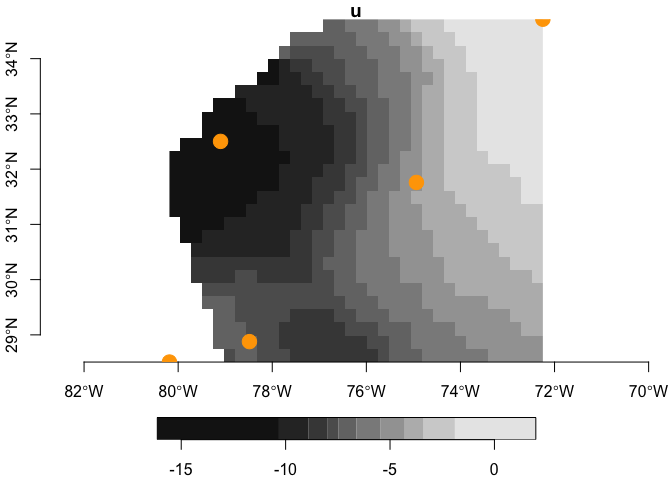

bsw
================

Provides for access to [Bended Sea
Winds](https://www.ncei.noaa.gov/products/blended-sea-winds) online.

### [Citation](https://www.ncei.noaa.gov/products/blended-sea-winds)

### Requirements

From CRAN…

-   [R v4+](https://www.r-project.org/)
-   [rlang](https://CRAN.R-project.org/package=rlang)
-   [dplyr](https://CRAN.R-project.org/package=dplyr)
-   [stars](https://CRAN.R-project.org/package=stars)
-   [sf](https://CRAN.R-project.org/package=sf)

From github… + [xyzt](https://github.com/BigelowLab/xyzt)

### Installation

    remotes::install_github("BigelowLab/bsw")

``` r
suppressPackageStartupMessages({
  library(bsw)
  library(dplyr)
  library(sf)
  library(xyzt)
  library(stars)
})
```

#### Organization of Blended Sea Winds

Blended Sea Winds are organized by product and interval. The two primary
product types are `[u,v,w]` wind velocities and `[taux, taux, tau]` wind
stresses. Each product type is organized further by aggregation interval
`[6h, daily, monthly]`. Wind velocity also have a climatalogical
aggregate mean (not served for stress.) Note that for 6h wind and 6h
stress only `[u,v]` and `[taux, tauy]` are served.

``` r
bsw_tally()
```

    ## # A tibble: 7 × 5
    ##   name             longname                    vars  t0                  time_…¹
    ##   <chr>            <chr>                       <chr> <dttm>                <int>
    ## 1 6h_agg           Aggregation_of_6h_Ocean_Wi… u, v  1987-07-09 00:00:00   35400
    ## 2 daily_agg        Aggregation_of_Daily_Ocean… u, v… 1987-07-09 09:00:00    8652
    ## 3 monthly_agg      Aggregation_of_Monthly_Oce… u, v… 1987-07-15 00:00:00     291
    ## 4 clm_agg          Latest_Climatology_of_Ocea… u, v… 0000-01-13 00:00:00      12
    ## 5 6h_strs_agg      Aggregation_of_6h_Ocean_Wi… taux… 1987-07-09 00:00:00   35396
    ## 6 daily_strs_agg   Aggregation_of_Daily_Ocean… taux… 1987-07-09 09:00:00    8850
    ## 7 monthly_strs_agg Aggregation_of_Monthly_Oce… taux… 1987-07-15 00:00:00     291
    ## # … with abbreviated variable name ¹​time_count

#### Working with points.

See the [xyzt](https://github.com/BigelowLab/xyzt) package for more
details on the example Southern US Atlantic Bight data. Note we must
transform the longitude values from \[-180, 180\] to \[0,360\] to work
with BSW data.

``` r
# read in example SAB points - note that time is required as a dimension
x <- xyzt::read_sab() |>
  dplyr::select(-time, -depth) |>
  dplyr::mutate(lon = xyzt::to_360(lon),
                time = as.POSIXct("1995-12-18 23:00:05", tz = "UTC")) |>
  xyzt::as_POINT(dims = "xyt")


# generate the BSW url for a given product
url <- bsw_url("Aggregation_of_6h_Ocean_Wind")


# open the resource (we can close it later)
X <- ncdf4::nc_open(url)

# extract the data 
covars <- bsw::extract(x, X, varname = c("u", "v"))

# bind to the input
(y <- dplyr::bind_cols(x, covars))
```

    ## Simple feature collection with 5 features and 4 fields
    ## Geometry type: POINT
    ## Dimension:     XYM
    ## Bounding box:  xmin: 279.815 ymin: 28.508 xmax: 287.752 ymax: 34.714
    ## Geodetic CRS:  WGS 84
    ## # A tibble: 5 × 5
    ##   id    name                               geometry     u     v
    ## * <chr> <chr>                           <POINT [°]> <dbl> <dbl>
    ## 1 41009 Canveral       M (279.815 28.508 819327605) -5.83 10.5 
    ## 2 41010 Canaveral East M (281.515 28.878 819327605) -5.98  8.49
    ## 3 41002 South Hatteras M (285.064 31.759 819327605) -3.35  3.73
    ## 4 41001 East Hatteras  M (287.752 34.714 819327605)  4.52 -1.59
    ## 5 41004 EDISTO         M (280.901 32.502 819327605) -7.95  9.18

#### Working with bounding boxes (from points or polygons).

Learn more about working with
[stars](https://CRAN.R-project.org/package=stars) objects in the
[vignettes](https://r-spatial.github.io/stars/).

``` r
# read in example SAB points
x <- xyzt::read_sab() |>
  dplyr::select(-time, -depth) |>
  dplyr::mutate(lon = xyzt::to_360(lon),
                time = as.POSIXct("1995-12-18 23:00:05", tz = "UTC")) |> 
  xyzt::as_BBOX(dims = 'xyt')

(covars <- bsw::extract(x, X, varname = c("u", "v")))
```

    ## stars object with 2 dimensions and 2 attributes
    ## attribute(s):
    ##          Min.    1st Qu.    Median      Mean   3rd Qu.     Max. NA's
    ## u  -16.145712 -8.3750913 -6.614542 -6.302016 -3.900675 1.982066  100
    ## v   -5.335568 -0.7151657  1.010905  1.553105  4.333930 9.367661  100
    ## dimension(s):
    ##   from to  offset     delta refsys point values x/y
    ## x    1 34 279.815  0.233441 WGS 84    NA   NULL [x]
    ## y    1 26  34.714 -0.238692 WGS 84    NA   NULL [y]

Now let’s see what it looks like.

``` r
x <- xyzt::read_sab() |>
  dplyr::select(-time, -depth) |>
  dplyr::mutate(lon = xyzt::to_360(lon)) |>
  xyzt::as_POINT()
par(mfrow = c(1,2))
plot(covars, attr = 'u', axes = TRUE, reset = FALSE)
plot(sf::st_geometry(x), add = TRUE, col = "orange", pch = 19, cex = 2)
```

<!-- -->

``` r
# cleanup
ncdf4::nc_close(X)
```
